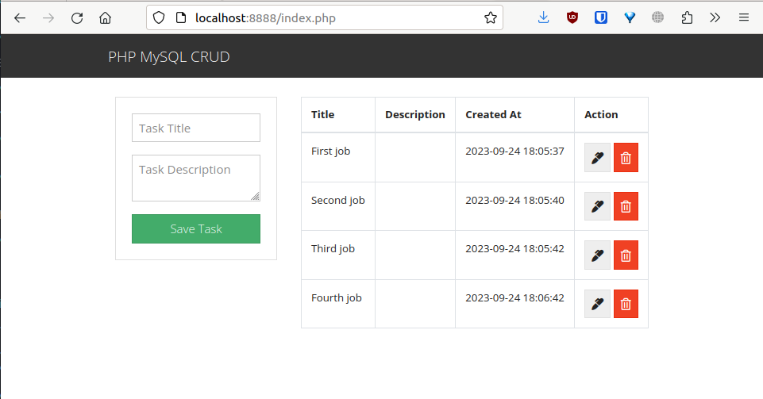

# Module-05 Docker

## The task
Write a docker-compose file for https://github.com/FaztWeb/php-mysql-crud.

Docker compose must:
- deploy a web-server in a container
- deploy a database in another container
- use bridge networking mode
- the apache port must not be 80

Will be a plus:
- ports in docker compose file are parameterized
- database content must be preserved when removing docker-compose stack
- use the .ENV file for local or sensitive data (username, database password, etc.)

## Implementation steps
1. Create [`Makefile`](Makefile):
    ```make
    .PHONY: clone build run

    clone:
        git clone https://github.com/FaztWeb/php-mysql-crud.git src

    build:
        docker compose build

    run: build
        docker compose up -d
    ```

    And run:
    ```shell
    $ make clone
    ```
    to download the application source code to a `src` directory.

2. Make some changes to the application source code:
    * Add `IF NOT EXISTS` to `script.sql`:
        ```sql
        CREATE DATABASE IF NOT EXISTS php_mysql_crud;

        use php_mysql_crud;

        CREATE TABLE IF NOT EXISTS task(
        id INT(11) PRIMARY KEY AUTO_INCREMENT,
        title VARCHAR(255) NOT NULL,
        description TEXT,
        created_at TIMESTAMP DEFAULT CURRENT_TIMESTAMP
        );

        DESCRIBE task;
        ```
    * Replace hardcoded parameters with environment variables in `db.php`:
        ```php
        <?php
        session_start();

        $conn = mysqli_connect(
        $_ENV['DB_HOST'],
        $_ENV['DB_USER'],
        $_ENV['DB_PASSWORD'],
        $_ENV['DB_NAME']
        ) or die(mysqli_erro($mysqli));

        ?>
        ```
3. Create [`.env`](.env) file:
    ```ini
    APACHE_PORT=8888
    MYSQL_ROOT_PASSWORD=password123
    MYSQL_DATABASE=php_mysql_crud
    MYSQL_USER=user
    MYSQL_PASSWORD=password123
    ```

4. Create [`docker-compose.yml`](docker-compose.yml) file:
    ```yaml
    version: '3'

    services:
    webserver:
        build: .
        ports:
            - "${APACHE_PORT}:80"
        environment:
            DB_HOST: crud-database
            DB_USER: ${MYSQL_USER}
            DB_PASSWORD: ${MYSQL_PASSWORD}
            DB_NAME: ${MYSQL_DATABASE}
        depends_on:
            - crud-database
        networks:
            - crud-network

    crud-database:
        image: mysql:5.7
        hostname: crud-database
        environment:
            MYSQL_ROOT_PASSWORD: ${MYSQL_ROOT_PASSWORD}
            MYSQL_DATABASE: ${MYSQL_DATABASE}
            MYSQL_USER: ${MYSQL_USER}
            MYSQL_PASSWORD: ${MYSQL_PASSWORD}
        volumes:
            - ./src/database/script.sql:/docker-entrypoint-initdb.d/script.sql
            - db-data:/var/lib/mysql
        networks:
            - crud-network

    networks:
    crud-network:
        driver: bridge

    volumes:
    db-data:
    ```

    #### Notes:
    * The `environment` sections allows the stack to get configuration data from the `.env` file.
    * The `script.sql` is used to initially create the database structure.
    * The `db-data` volume is created for the database data to survive stack restarts.

1. Create a [`Dockerfile`](Dockerfile) for webserver container:
    ```docker
    FROM php:8-apache
    COPY src/ /var/www/html/
    RUN docker-php-ext-install mysqli pdo_mysql && docker-php-ext-enable mysqli pdo_mysql
    ```

## Usage
1. Run the deployment:
    ```shell
    $ make run
    ```

1. Start the browser and type in:
    ```
    http://localhost:8888
    ```
    to check the application web UI.

